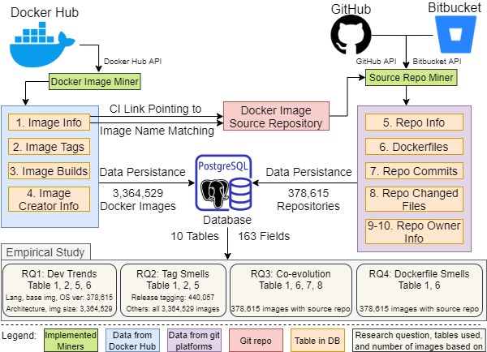
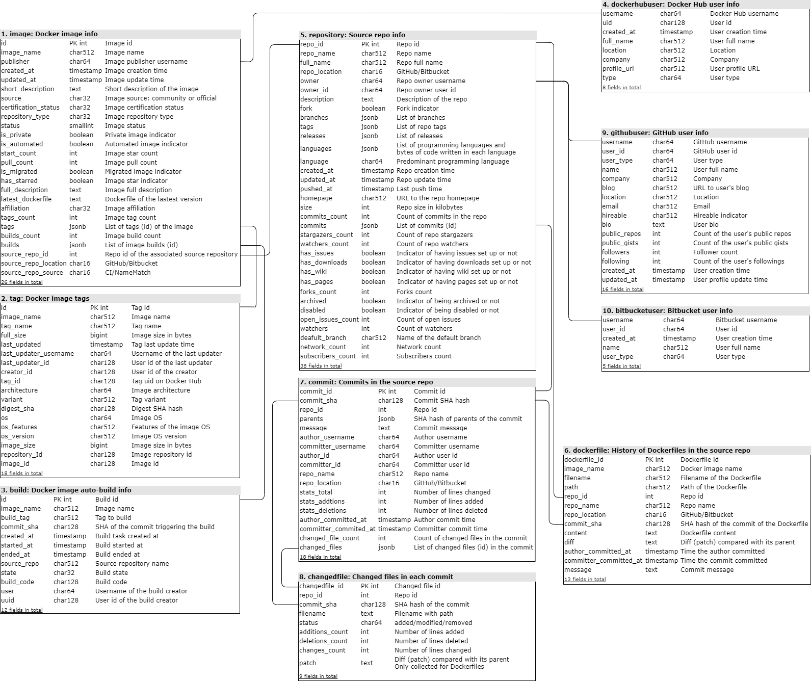
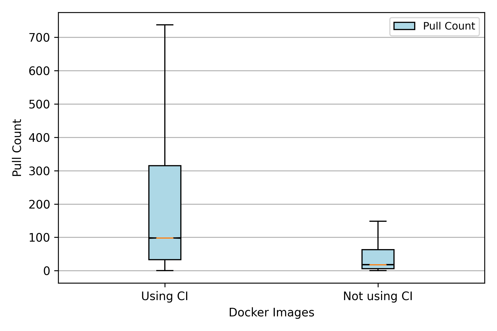
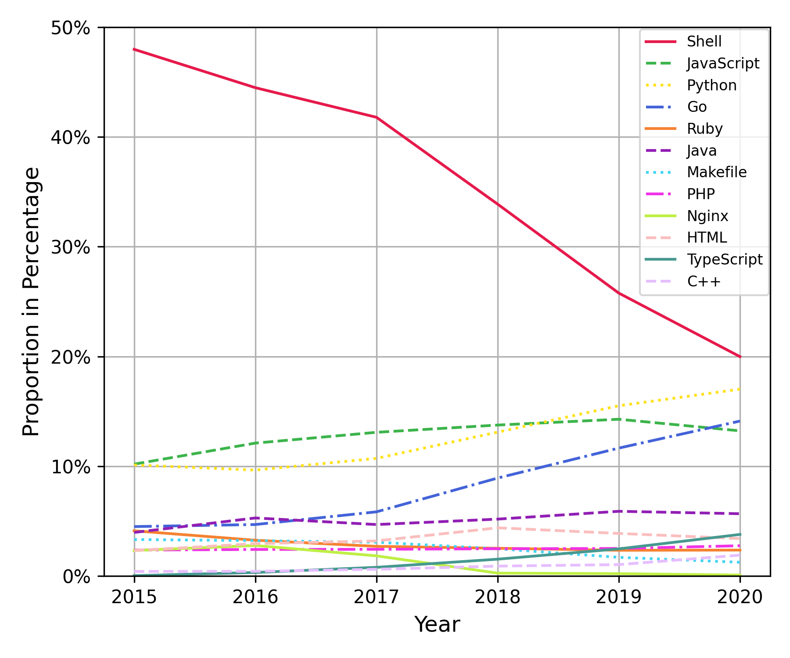
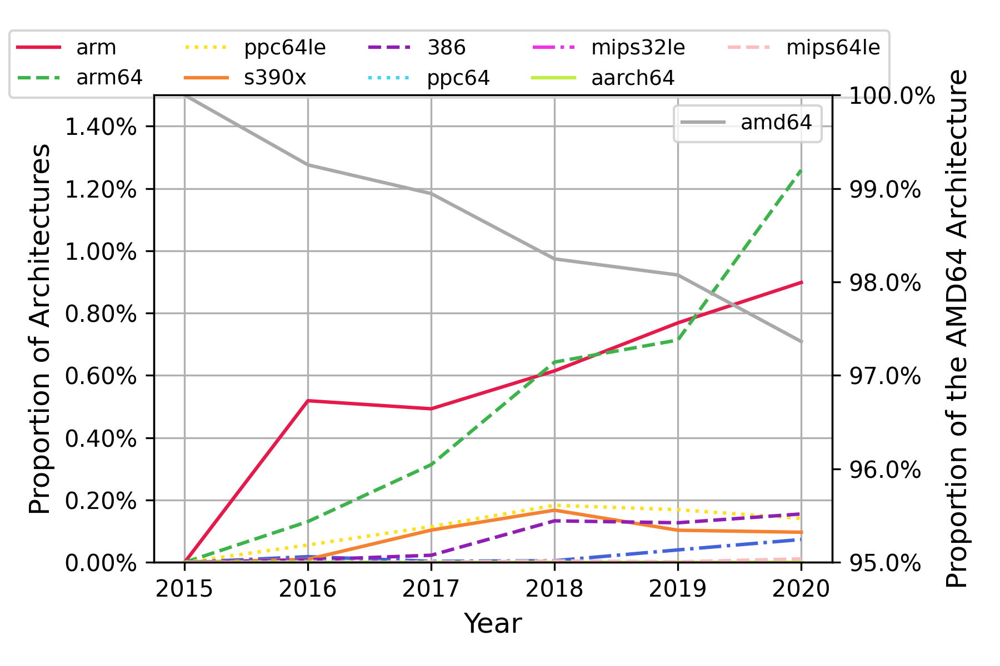
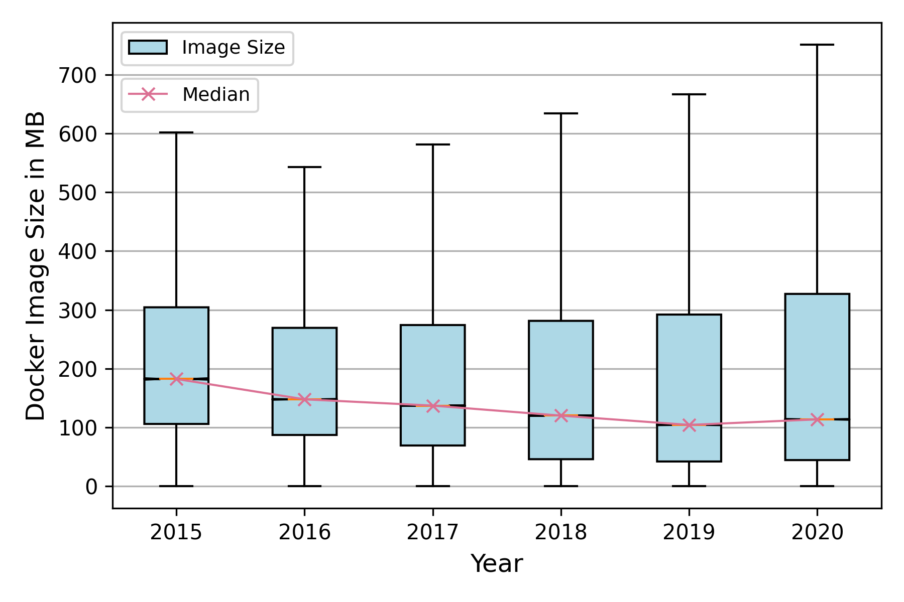
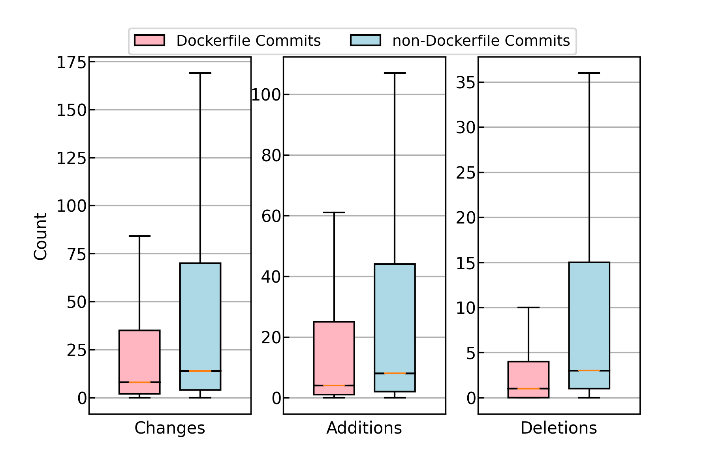
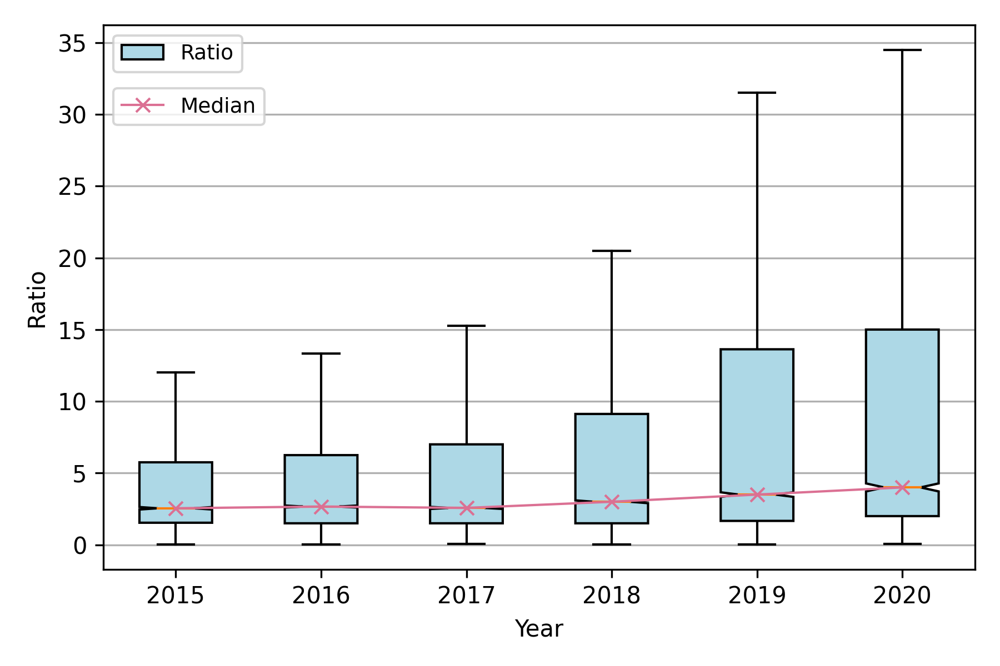
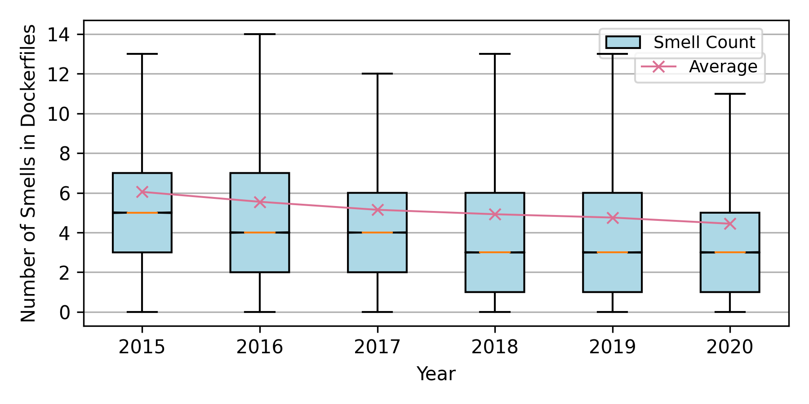
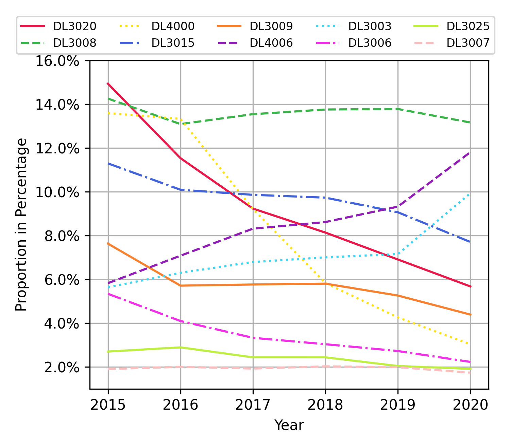

# A Large-scale Data Set and an Empirical Study of Docker Images Hosted on Docker Hub
Artifact repository for the paper "A Large-scale Data Set and an Empirical Study of Docker Images Hosted on Docker Hub." This reproducible repository includes the data set and its description, source code of the implemented miners, and all analysis scripts and results in the paper.
## Overview of the methods for data collection and overview of the empirical study

* We create, to the best of our knowledge, the largest available Docker data set collected from both real-world Docker images hosted on Docker Hub, and their source repositories from both GitHub and Bitbucket. 
    * 3,364,529 Docker images
    * 378,615 corresponding git repositories
    * Covering 98.38% of Docker images hosted on Docker Hub as of May 3, 2020.
* Using this new and more comprehensive data set, we reproduce the phenomenon studied by previous work and compare our results.
* We investigate new evolution trends to understand the changes in the Docker ecosystem as well as how Dockerfiles co-evolve with other source code.
* Given the new data from Docker Hub, we study Docker image tagging practices as well as the evolution of image sizes and architectures.

## Artifacts
### A Large-scale Data Set of Docker Images Hosted on Docker Hub (Section IV)
* [Link to the Data Set](https://zenodo.org/record/3862987)
* Data Set Schema and Fields Description (See the data set section below)
* [Distribution of the Pull Count for Docker Images Using CI / not Using CI](./Docs/dataset/dataset.ipynb)
* [Facts about the Data Set](./Docs/dataset/dataset.ipynb)
* [Implemented Miners](./Miners)
    * [Docker Image Miner](./Miners/DockerImageMiner)
    * [Source Repo Miner](./Miners/SourceRepoMiner)
    * [Web Application for Coordinating Miners and Data Storage](./Miners/webapp)

### A Large-scale Empirical Study of Docker Images Hosted on Docker Hub (Section V)
* [RQ1: What is the current state of Docker image development and how did it evolve over time?](./RQs/RQ1/RQ1.ipynb)
* [RQ2: What are the current Docker image tagging practices?](./RQs/RQ2/RQ2.ipynb)
* [RQ3: How do Dockerfiles co-evolve with other source code?](./RQs/RQ3/RQ3.ipynb)
* [RQ4: How prevalent are code smells in Dockerfiles?](./RQs/RQ4/RQ4.ipynb)

## Requirements
### Data Set Collection and Curation
* Docker Engine >= 19.03.9 ([Installation Guide](https://docs.docker.com/engine/install/))
* PostgreSQL >= 11 ([Installation Guide](https://www.postgresql.org/download/))
* Python >= 3.8
* pip >= 19.1.1

Required Python packages for the data set collection and curation are listed in [./Miners/webapp/requirements.txt](./Miners/webapp/requirements.txt)

Installation:
```
pip install -r ./Miners/webapp/requirements.txt
```

### Empirical Study
* Python >= 3.8
* pip >= 19.1.1
* [hadolint](https://github.com/hadolint/hadolint) (for RQ4 only)

Required Python packages for empirical studies are listed in [./Docs/requirements.txt](./Docs/requirements.txt)

Installation:
```
pip install -r ./Docs/requirements.txt
```

## Data Set
### Usage
The data set is publicly available on Zenodo. Please download the data set through [this link](https://zenodo.org/record/3862987/files/docker_dataset.sql).

Please create the corresponding database before loading the data set. We use 'dockerstudy' as the database name/username/password in our analysis scripts.

Load the data set into the PostgreSQL database.

```
psql database-name < docker_dataset.sql
```

### Schema and Fields Description
The data set contains 10 tables and 163 fields. It is the first data set of Docker images that is based on Docker Hub, GitHub, and Bitbucket, rather than solely Dockerfiles on GitHub.



### Data Collection and Curation
We implement Docker Image Miner and Source Repo Miner for data collection. The miners can continuously obtain new data from Docker Hub and the associated GitHub/Bitbucket repositories or update existing data. We implement and containerize two miners, and their source code is available through the following links.
* [Docker Image Miner](./Miners/DockerImageMiner)
* [Source Repo Miner](./Miners/SourceRepoMiner)

For collecting a large-scale data set in a distributed way, the miners are coordinated by a Django-based web application, which is responsible for sending tasks to miners, receiving data from miners, and persisting data in the PostgreSQL database. The source code of the web application can be found [here](./Miners/webapp). The steps to set up the whole data collection system are as follows.
* Set up the web application (Working directory is [here](./Miners/webapp))
    1. Create a database for data storage in PostgreSQL.
    2. Modify the configurations regarding the database in [settings.py](./Miners/webapp/webapp/settings.py). Please modify line 83 - 88 and make those configurations (specifically, DB host, DB name, DB username, DB password, and DB port) aligned with your settings.
    3. Create database migrations `python manage.py makemigrations dockerstudy`
    4. Migrate database `python manage.py migrate`
    5. Create a superuser for ease of web application management `python create_superuser.py`. The default username is 'admin', and the password is 'password'. You can modify them in [create_superuser.py](./Miners/webapp/create_superuser.py)
    6. Initialize the web application and database `python ./db_op/DockerImageMiner_db_init.py`
    7. Start the web application `gunicorn --workers=64 --bind 0.0.0.0:8000 webapp.wsgi` and the web application should be running on http://your-ip-address:8000/
    
* Set up miners
    1. Modify the URL of the web application defined in [DockerImageMiner.py](./Miners/DockerImageMiner/DockerImageMiner.py) and [SourceRepoMiner.py](./Miners/SourceRepoMiner/SourceRepoMiner.py). Please make sure that `your-webapp-url` in two miners is replaced with the IP address of the web application.
    2. Build the Docker Image Miner  (Working directory is [here](./Miners/DockerImageMiner)) `docker build -t docker-image-miner .`
    3. Build the Source Repo Miner  (Working directory is [here](./Miners/SourceRepoMiner)) `docker build -t source-repo-miner .`
    4. Credentials are required to access APIs of GitHub and Bitbucket. For large-scale data mining, please prepare enough access tokens for [GitHub](https://help.github.com/en/github/authenticating-to-github/creating-a-personal-access-token-for-the-command-line) and [Bitbucket](https://confluence.atlassian.com/bitbucketserver/personal-access-tokens-939515499.html). We implement a token pool in the web application. Please load your access tokens into the `dockerstudy_authtoken` table in the database. The token pool distributes tokens to miners, makes sure each token complies with the API rate limit, and refreshes tokens automatically.
        * For each GitHub token, please specify the access token in the `token` field, and specify `GitHub` in the `token_type` field.
        * For each Bitbucket token, please specify the username and password in the `token` field as `username:password`, and specify `Bitbucket` in the `token_type` field.
    5. Deploy miner containers on Kubernetes/Docker Swarm cluster or using the Docker engine. The miners can continuously obtain new data from Docker Hub and the associated GitHub/Bitbucket repositories or update existing data. All collected data will be stored in the PostgreSQL database.

## Research Questions in the Empirical Study
For each RQ, there is a Jupyter notebook in the corresponding folder for reproducing all numbers, figures, and analysis results in the paper. All analysis scripts are written in Python.
* [RQ1: What is the current state of Docker image development and how did it evolve over time?](./RQs/RQ1/RQ1.ipynb)
* [RQ2: What are the current Docker image tagging practices?](./RQs/RQ2/RQ2.ipynb)
* [RQ3: How do Dockerfiles co-evolve with other source code?](./RQs/RQ3/RQ3.ipynb)
* [RQ4: How prevalent are code smells in Dockerfiles?](./RQs/RQ4/RQ4.ipynb)

Before executing scripts of each RQ, the data set should be ready in the PostgreSQL database. Please follow the ***Usage*** in the ***Data Set*** section above to download the data set from Zenodo, load the data, and set up the database.

Please modify the ***Database Configurations*** in the Jupyter notebooks and make it aligned with the configurations of the database in your environment. The following parameters should be configured.

* Define the username of the database server. The default value is dockerstudy.
```
POSTGRESQL_USER = os.getenv('POSTGRESQL_USER') if os.getenv('POSTGRESQL_USER') is not None else 'dockerstudy'
```

* Define the password of the database user. The default value is dockerstudy.
```
POSTGRESQL_PASSWORD = os.getenv('POSTGRESQL_PASSWORD') if os.getenv('POSTGRESQL_PASSWORD') is not None else 'dockerstudy'
```

* Define the IP address of the database server. The default value is localhost.
```
POSTGRESQL_HOST_IP = os.getenv('POSTGRESQL_HOST_IP') if os.getenv('POSTGRESQL_HOST_IP') is not None else 'localhost'
```

* Define the port of the database server. The default value is 5432.
```
POSTGRESQL_PORT = os.getenv('POSTGRESQL_PORT') if os.getenv('POSTGRESQL_PORT') is not None else '5432'
```

* Define the database name of the Docker data set. The default value is dockerstudy.
```
POSTGRESQL_DATABASE = os.getenv('POSTGRESQL_DATABASE') if os.getenv('POSTGRESQL_DATABASE') is not None else 'dockerstudy'
```

## Abstract of the Paper
Docker is currently one of the most popular containerization solutions. Previous work investigated various characteristics of the Docker ecosystem, but has mainly focused on Dockerfiles from GitHub, limiting the type of questions that can be asked, and did not investigate evolution aspects. In this paper, we create a recent and more comprehensive data set by collecting data from Docker Hub, GitHub, and Bitbucket. Our data set contains information about 3,364,529 Docker images and 378,615 git repositories behind them. Using this data set, we conduct a large-scale empirical study with four research questions where we reproduce previously explored characteristics (e.g., popular languages and base images), investigate new characteristics such as image tagging practices, and study evolution trends. Our results demonstrate the maturity of the Docker ecosystem: we find more reliance on ready-to-use language and application base images as opposed to yet-to-be-configured OS images, a downward trend of Docker image sizes demonstrating the adoption of best practices of keeping images small, and a declining trend in the number of smells in Dockerfiles suggesting a general improvement in quality. On the downside, we find an upward trend in using obsolete OS base images, posing security risks, and find problematic usages of the latest tag, including version lagging. Overall, our results bring good news such as more developers following best practices, but they also indicate the need to build tools and infrastructure embracing new trends and addressing potential issues.


## Figures
Hover to see the caption.
### Pull Count Distribution



### RQ1










### RQ2
[Link to the Jupyter notebook](./RQs/RQ2/RQ2.ipynb)


### RQ3





### RQ4






